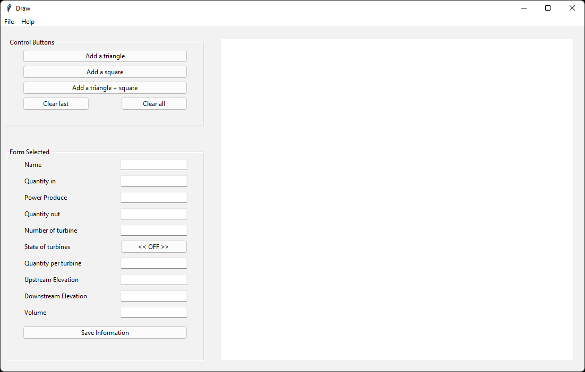
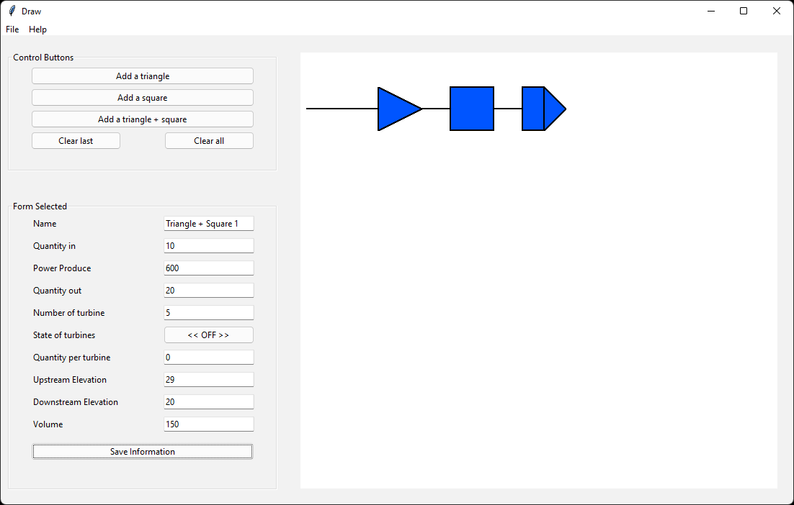
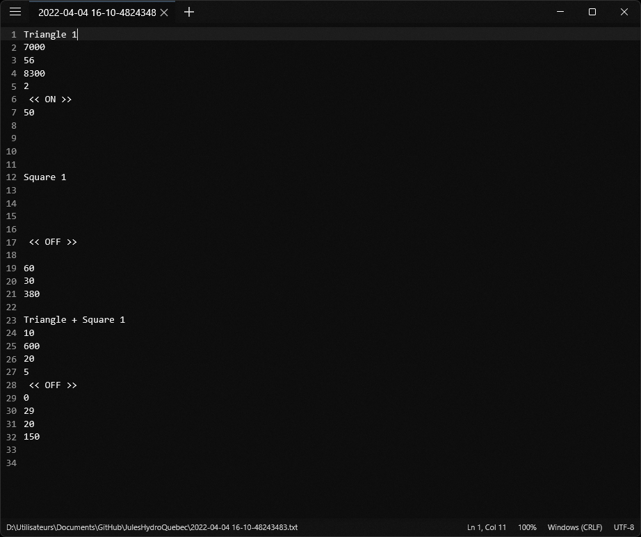

## Hydropower Production System Interface

A <code>Python</code> & <code>TCL style</code> GUI to simulate the values of a hydroelectric system.

## Description

The aim of this project is to simulate a hydroelectric production system, the collection of data to the operation of the turbines.

Dynamic programming uses the total throughput calculated by short-term optimization to determine the turbinated unit start by each of the turbines. A user interface will allow to visualize the turbines in operation according to the result of the algorithm.

## Requirement

- Python 3

## Installation

Download the [latest release](https://github.com/JulesCtn/JulesHydroQuebec/releases/), or clone the repo above.\

### Manual installation

1. You need to unpack the folder and start GUY.py
2. Export files will be saved in the same folder of GUY.py

## Known bugs

None bugs have been reported yet.

### New bugs

If you've found a new bug, please report it as a new issue with the templates provided.

Thanks!

## Screenshot

### GUI

### File exported

